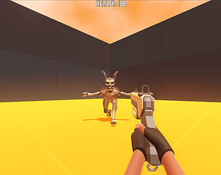

# Mark's Boomer Shooter

This is an open source prototype of a Godot FPS Game.

Play it in your browser or download it for Linux and Windows on [Itch.io](https://bearlikelion.com/boomer-shooter)

I developed this over a weekend to get a better understanding of state machines.\
I learned a lot from the [Godot-4-fpsarms](https://github.com/gdquest-demos/godot-4-FPS-arms) demo

## Controls:
* WASD - Movement
* R - Reload
* Space - Jump
* Shift - Sprint
* Ctrl - Crouch
* Sprint+Crouch - Slide

## Save File
I use a Godot resource to save data for the player.
You can load the saved data statically using:\
	`var player_save: PlayerSave = PlayerSave.load_player_data()`

Add any export variables you wish to store, and then save using:\
	`player_save.save_player_data(player_save)`

## Credits & Attribution:
Music by **Troll-Lyd**: [SoundCloud](https://soundcloud.com/troill-lyd), [Itch.io](https://troll-lyd.itch.io/)\
Font is [Geizer](https://www.dafont.com/geizer.font)\
Enemy is [FPS Character Beetle](https://opengameart.org/content/fps-character-beetle) by **rohin_n**\
Prototype Textures by [Kenney](https://www.kenney.nl/assets/prototype-textures)\
Main Menu Backgroud image by [Écrivain](https://opengameart.org/content/backgrounds-0)
